# Kubernetes Fundamentals Lab


> A Kubernetes cluster built from scratch using \*\*kubeadm\*\* on \*\*Ubuntu Server\*\* hosted in \*\*Google Cloud Platform (GCP)\*\*.
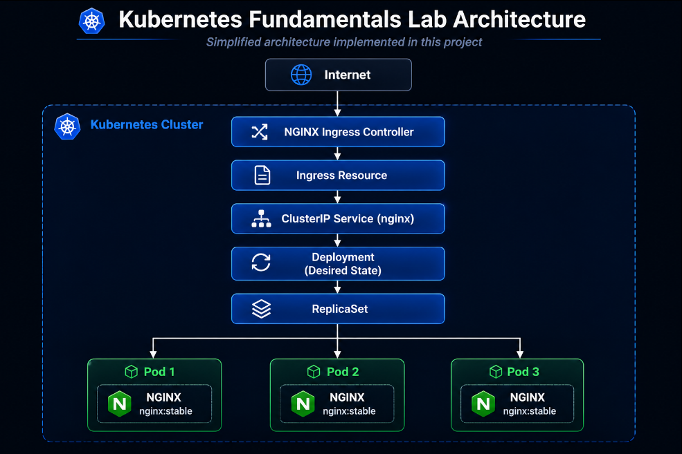


## Key Skills Demonstrated

- Kubernetes cluster initialization with kubeadm
- Container orchestration using Deployments and ReplicaSets
- Service discovery with ClusterIP Services
- HTTP routing with NGINX Ingress Controller
- Horizontal scaling and self-healing
- Rolling updates with zero downtime
- YAML manifest creation and management
- Kubernetes architecture and troubleshooting


## Project Overview


This project was built to understand how Kubernetes works behind the scenes rather than simply deploying an application.


Instead of building a complex web application, I intentionally deployed a simple \*\*NGINX\*\* container so the primary focus remained on Kubernetes itself. Throughout this lab I built the cluster from scratch, configured its networking, deployed workloads, demonstrated scaling, verified self healing, performed rolling updates, and configured an Ingress Controller.


The objective was to understand \*\*why\*\* each Kubernetes component exists, how they interact with one another, and how Kubernetes continuously maintains the desired state of applications.


---


## Objectives


\- Build a Kubernetes cluster from scratch using kubeadm.

\- Understand the role of the Kubernetes Control Plane.

\- Deploy a containerized application using a Deployment.

\- Learn how ReplicaSets maintain application availability.

\- Understand why Services exist and how they provide stable networking.

\- Demonstrate Kubernetes self healing.

\- Perform zero downtime rolling updates.

\- Configure an NGINX Ingress Controller.

\- Create an Ingress resource for HTTP routing.

\- Export reusable Kubernetes manifests for version control.


---


# Skills Demonstrated


## Kubernetes


\- Kubernetes Cluster Installation

\- kubeadm

\- kubectl

\- kubelet

\- Deployments

\- ReplicaSets

\- Pods

\- Services

\- Ingress

\- Rolling Updates

\- Horizontal Scaling

\- Self Healing


## Linux


\- Ubuntu Server Administration

\- SSH

\- File Management

\- YAML Configuration

\- Linux CLI


## Cloud


\- Google Cloud Platform

\- Compute Engine

\- Virtual Machines

\- Cloud Networking


## Containers


\- containerd

\- OCI Container Runtime

\- NGINX Container


## Version Control


\- Git

\- GitHub


---


# Technologies Used


| Category | Technology |

|-----------|------------|

| Cloud Platform | Google Cloud Platform (GCP) |

| Operating System | Ubuntu Server 24.04 LTS |

| Container Runtime | containerd |

| Container Image | NGINX |

| Orchestration | Kubernetes |

| Cluster Bootstrap | kubeadm |

| Networking | Calico CNI |

| Ingress | NGINX Ingress Controller |

| CLI Tools | kubectl, kubeadm, kubelet |

| Version Control | Git \& GitHub |


---


# Project Structure


```text

kubernetes-fundamentals-lab/

│

├── README.md

├── LICENSE

├── .gitignore

│

├── deployment/

│   ├── deployment.yaml

│   ├── service.yaml

│   └── ingress.yaml

│

├── screenshots/

│   ├── 01-containerd-running.png

│   ├── ...

│   └── 14-ingress-resource-created.png

│

├── architecture/

│   └── kubernetes-architecture.png

│

└── docs/

&#x20;   ├── troubleshooting.md

&#x20;   └── lessons-learned.md

```


---


# Architecture


The following diagram represents the architecture implemented throughout this lab.


## HTTP Request Flow

The following diagram illustrates how an HTTP request travels through the Kubernetes components deployed in this project.

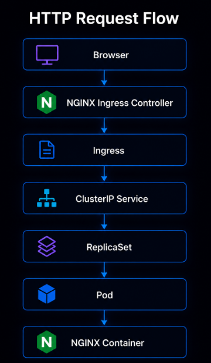


## Component Responsibilities


| Component | Responsibility |

|-----------|----------------|

| Deployment | Defines the desired state of the application and manages updates. |

| ReplicaSet | Ensures the desired number of Pods are always running. |

| Pod | Hosts one or more application containers. |

| Service | Provides a stable endpoint and load balances traffic across Pods. |

| Ingress | Defines HTTP routing rules. |

| Ingress Controller | Reads Ingress resources and routes incoming traffic to the correct Service. |


---


# Why NGINX?


I intentionally chose a simple NGINX container because the purpose of this project was to understand Kubernetes rather than application development.


Using a lightweight application removed unnecessary complexity and allowed me to focus entirely on Kubernetes architecture, networking, scaling, self healing, rolling updates, and Ingress.


---


# Implementation Journey


Rather than deploying everything at once, the cluster was built incrementally to understand the responsibility of each Kubernetes component. Every phase introduced one new concept before moving to the next layer of the Kubernetes architecture.


---


## Phase 1 – Cluster Preparation


The project began by provisioning an Ubuntu Server virtual machine in Google Cloud Platform. Native SSH access was configured from Windows Terminal to manage the server remotely without relying on the browser based console.


The Kubernetes environment was then prepared by installing:


\- containerd

\- kubeadm

\- kubelet

\- kubectl


Once the required components were installed, the Kubernetes control plane was initialized using \*\*kubeadm\*\*.


### Outcome


\- Ubuntu Server configured successfully

\- Kubernetes control plane initialized

\- kubectl configured

\- Node joined the cluster successfully


📸 Screenshots

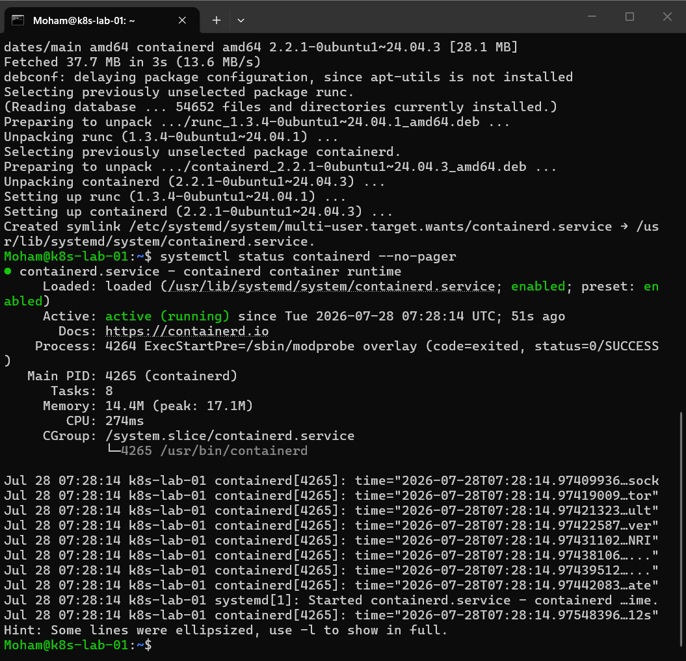

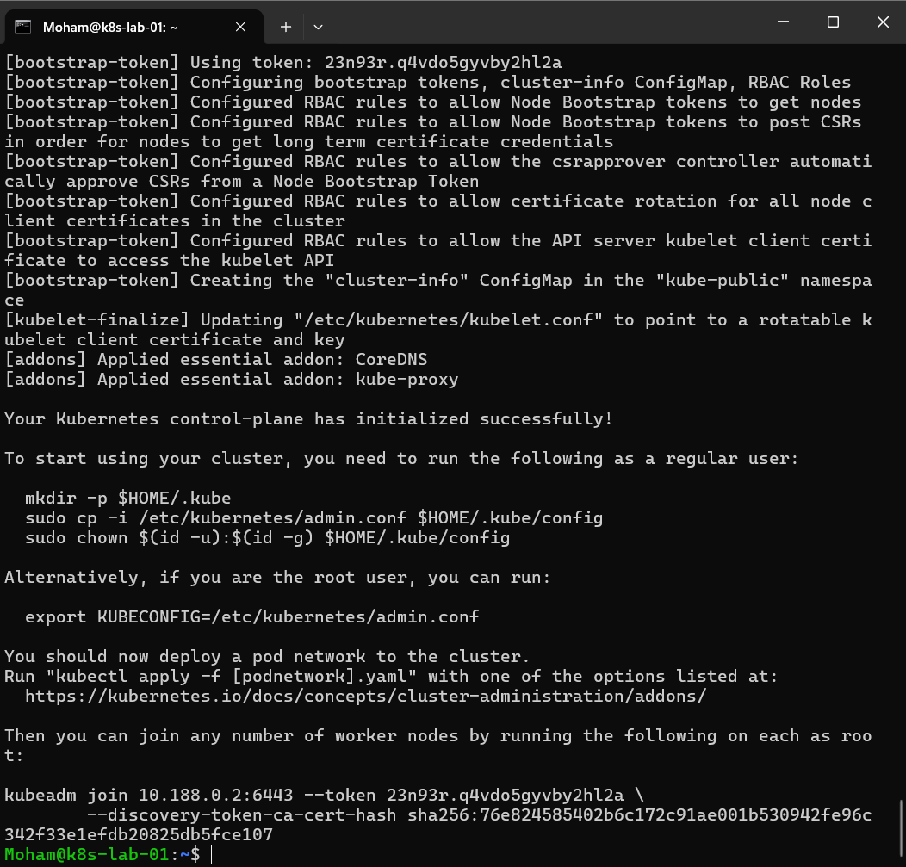

---

## Phase 2 – Cluster Networking

A Kubernetes cluster cannot schedule application Pods until networking has been configured.

To solve this, Calico CNI (Container Network Interface) was installed.

Calico provides networking between Pods and allows Kubernetes to assign Pod IP addresses and route traffic correctly throughout the cluster.

After installation, every system Pod entered the **Running** state, confirming that networking had been configured successfully.

### Outcome

- Calico installed
- Pod networking enabled
- Cluster healthy

📸 Screenshot

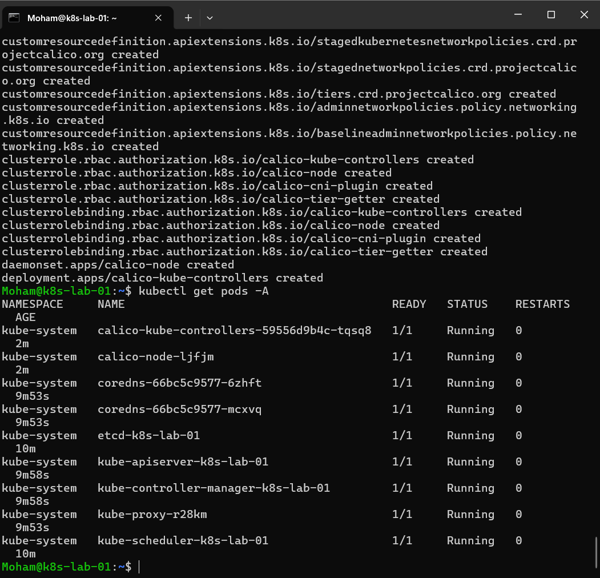

---

## Phase 3 – First Workload Deployment

With the cluster operational, the first application was deployed.

Rather than manually creating Pods, a Kubernetes **Deployment** was created.

The Deployment automatically created a ReplicaSet, which in turn created the required Pod.

This demonstrated Kubernetes' declarative model.

Instead of telling Kubernetes:

> Create one Pod.

The desired state was declared:

> I always want one running Pod.

### Outcome

- Deployment created
- ReplicaSet created automatically
- First Pod running

📸 Screenshot

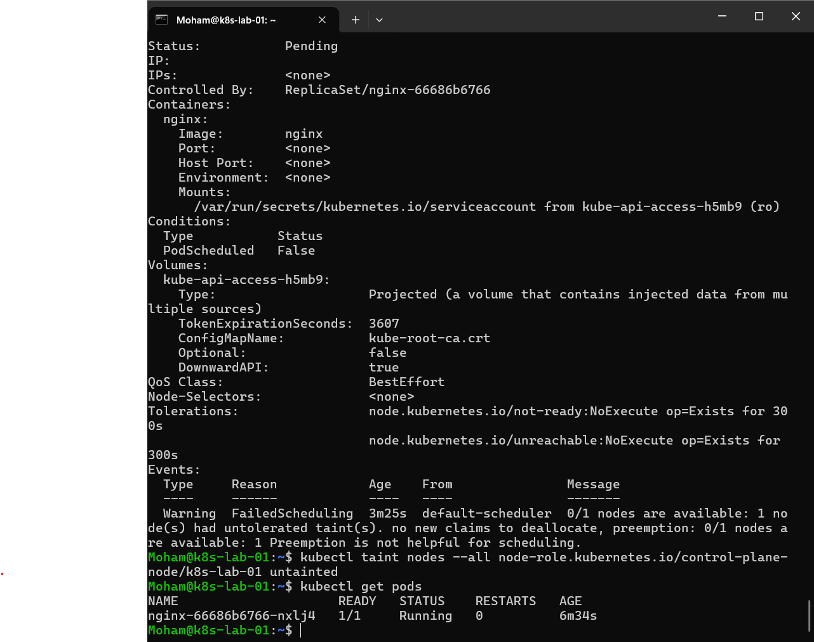

---

## Phase 4 – Service Networking

Pods receive dynamic IP addresses.

If a Pod is recreated, its IP address changes.

To solve this problem, a **ClusterIP Service** was created.

Instead of applications communicating directly with Pods, they communicate with the Service.

The Service continuously discovers healthy Pods using labels and selectors.

This abstraction allows Pods to be replaced without affecting application communication.

### Outcome

- Stable networking endpoint created
- Service connected to Deployment
- Traffic successfully routed to Pods

📸 Screenshot

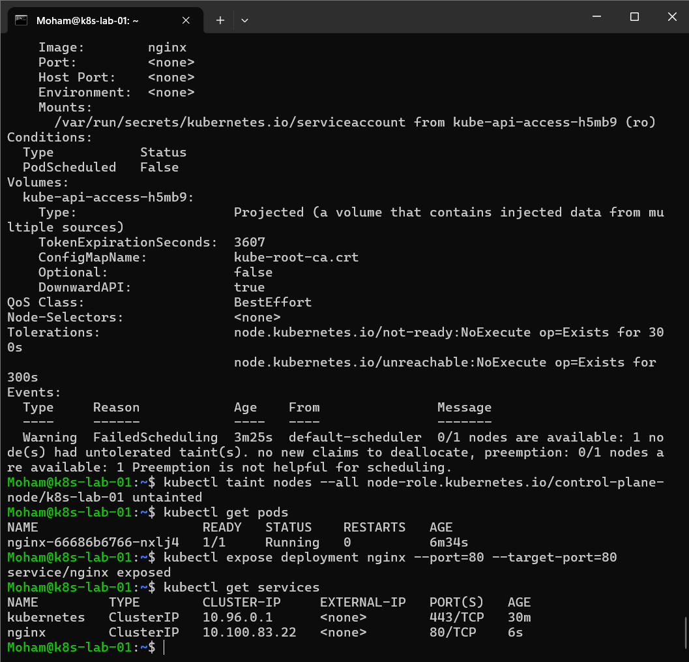

---

## Phase 5 – Horizontal Scaling

The Deployment was scaled from one replica to three replicas.

Rather than manually creating additional Pods, the Deployment's replica count was increased.

The ReplicaSet automatically scheduled additional Pods until the desired state was reached.

This demonstrated Kubernetes' ability to horizontally scale workloads.

### Outcome

- Three Pods running
- ReplicaSet maintained desired state
- Application horizontally scaled

📸 Screenshot

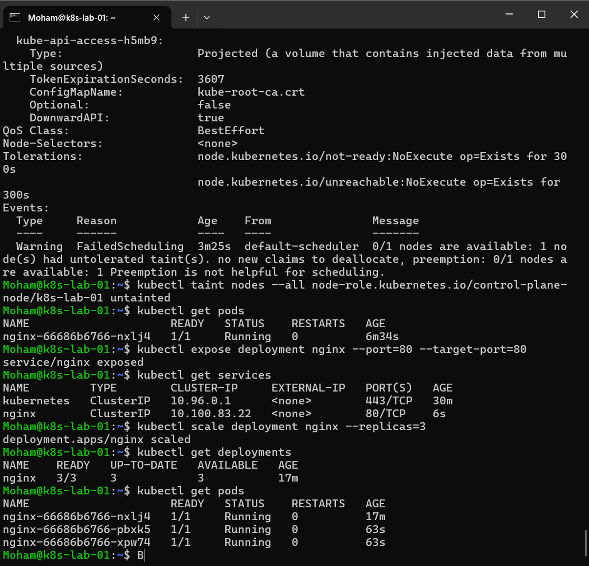

---

## Phase 6 – Self Healing

To verify Kubernetes self healing, one running Pod was intentionally deleted.

Instead of leaving the application with only two running Pods, the ReplicaSet immediately detected that the desired state no longer matched reality.

A replacement Pod was created automatically.

No manual intervention was required.

This demonstrated one of Kubernetes' most important capabilities.

### Outcome

- Pod intentionally deleted
- ReplicaSet detected failure
- Replacement Pod created automatically

📸 Screenshot

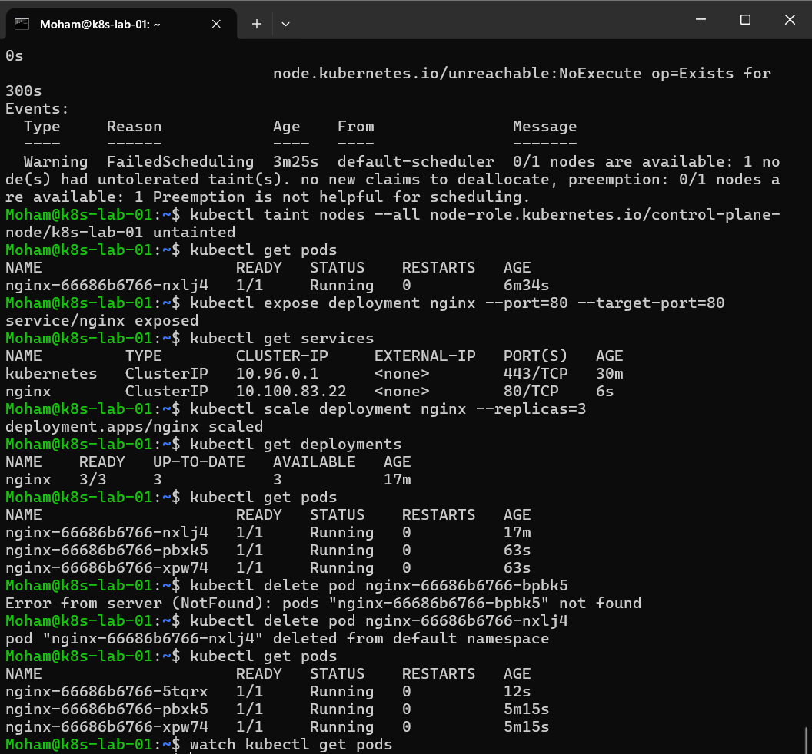

---

## Phase 7 – Rolling Updates

The Deployment image was updated from the original image to **nginx:stable**.

Instead of deleting every Pod simultaneously, Kubernetes performed a rolling update.

A new ReplicaSet was created.

New Pods became healthy before older Pods were terminated.

This ensured application availability throughout the update.

The previous ReplicaSet remained available for rollback if required.

### Outcome

- New ReplicaSet created
- Rolling update completed successfully
- Previous ReplicaSet retained for rollback

📸 Screenshots

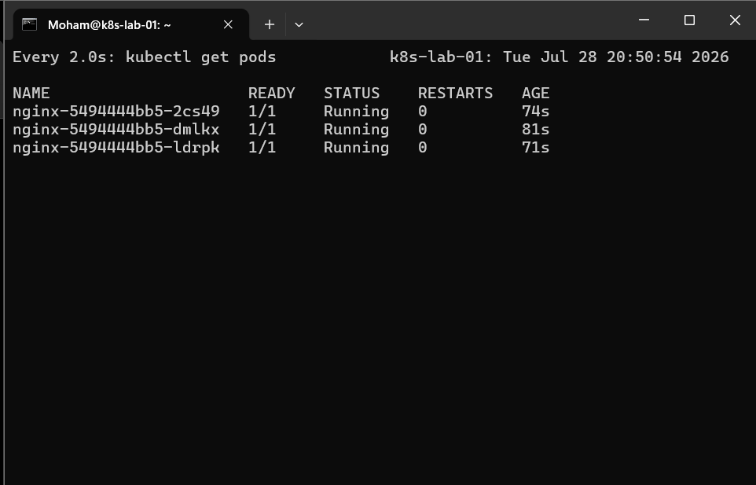

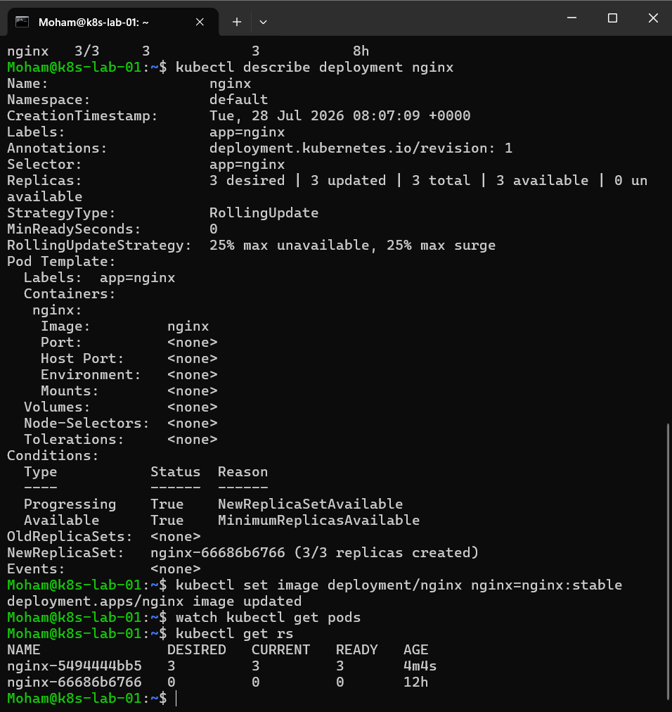

---

## Phase 8 – Ingress

The NGINX Ingress Controller was installed.

An Ingress resource was then created to define HTTP routing rules for the application.

This completed the full networking path from incoming traffic to the application Pods.

### Outcome

- Ingress Controller installed
- Ingress resource created
- HTTP routing configured successfully

📸 Screenshots

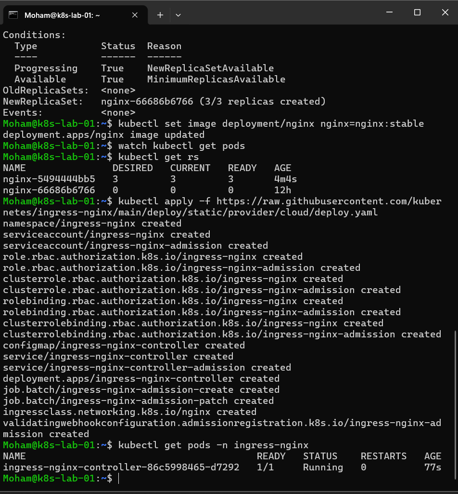

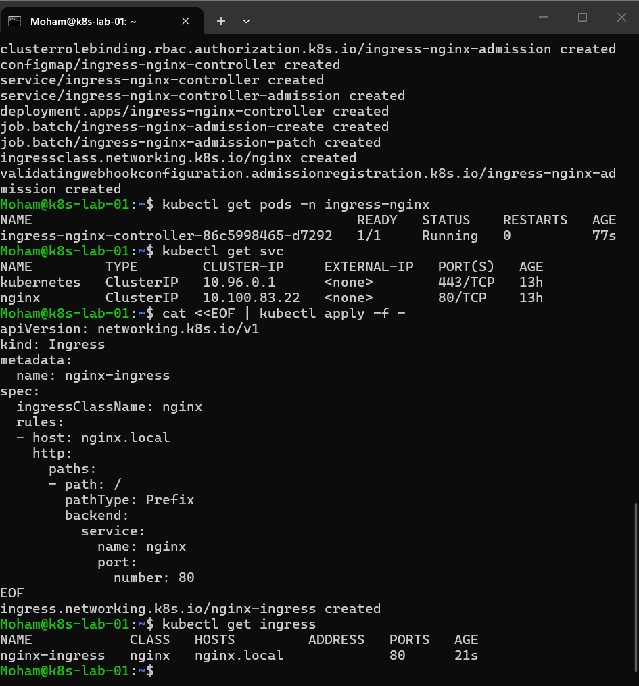


---


# Engineering Decisions


Throughout this project several design decisions were made intentionally to maximize learning rather than simply deploying an application.


## Why NGINX?


A lightweight container allowed the project to focus entirely on Kubernetes concepts without introducing unnecessary application complexity.


---


## Why containerd instead of Docker?


Kubernetes supports multiple OCI compliant container runtimes.


Modern Kubernetes distributions use \*\*containerd\*\* as the default runtime, making it the most appropriate choice for this lab.


---


## Why Deployments instead of manually creating Pods?


Deployments provide declarative management, ReplicaSets, rolling updates, rollback capabilities, and self healing.


Creating Pods directly would bypass many of Kubernetes' most important features.


---


## Why use a ClusterIP Service?


Pods receive temporary IP addresses.


A Service provides a permanent endpoint that automatically routes traffic to healthy Pods.


Applications communicate with the Service instead of individual Pods.


---


## Why install an Ingress Controller?


An Ingress resource only defines routing rules.


An Ingress Controller reads those rules and performs the actual HTTP routing.


Separating configuration from implementation is one of Kubernetes' core design principles.


---


# Verification


The following functionality was successfully demonstrated throughout the project.


✅ Kubernetes control plane initialized


✅ Calico networking operational


✅ Application Deployment created successfully


✅ ReplicaSet automatically created


✅ Pod scheduling verified


✅ Stable networking through ClusterIP Service


✅ Horizontal scaling from one to three replicas


✅ Automatic self healing after Pod deletion


✅ Rolling updates completed successfully


✅ Previous ReplicaSet retained for rollback


✅ NGINX Ingress Controller operational


✅ Ingress resource successfully configured


---


# Screenshots


The following screenshots document the major milestones completed throughout this project.


| Phase | Screenshot |

|--------|------------|

| Container Runtime Installation | `01-containerd-running.png` |

| Kubernetes Control Plane | `02-control-plane-initialized.png` |

| Cluster Health | `03-cluster-health.png` |

| First Deployment | `04-first-deployment.png` |

| Service Creation | `05-service-created.png` |

| Scaling to Three Replicas | `06-scaled-to-three-replicas.png` |

| Self Healing Demonstration | `07-self-healing.png` |

| Rolling Update | `08-rolling-update.png` |

| ReplicaSet History | `09-replicaset-history.png` |

| NGINX Ingress Controller | `10-ingress-controller.png` |

| Ingress Resource | `11-ingress-resource.png` |


---


# Troubleshooting


One of the most valuable parts of this project was solving real engineering problems rather than simply following installation steps.


## Native SSH Configuration


Instead of relying on the Google Cloud browser console, native SSH access was configured through Windows Terminal. This created a workflow similar to managing a production Linux server.


---


## Pending Pods


Initially Pods could not be scheduled because cluster networking had not yet been installed.


Installing Calico resolved the issue and allowed Kubernetes to assign Pod IP addresses.


---


## Understanding Desired State


One of the biggest conceptual lessons was learning that Kubernetes is continuously trying to make reality match the declared desired state.


Deleting a Pod does not mean the application should have fewer Pods.


Instead, Kubernetes immediately recreates the missing Pod until the desired replica count is restored.


---


## Rolling Updates


During rolling updates I learned that Kubernetes creates a brand new ReplicaSet instead of modifying the existing one.


The previous ReplicaSet remains available for rollback until it is no longer needed.


---


## Kubernetes Manifests


The exported manifests contained runtime information generated by Kubernetes including:


\- UID

\- Resource Version

\- Status

\- Creation Timestamp


These fields were removed to produce clean, reusable manifests suitable for version control.


---


# Lessons Learned


This project significantly improved my understanding of Kubernetes architecture and how each component contributes to application availability.


Some of my biggest takeaways include:


\- Kubernetes is a platform for maintaining the desired state rather than simply running containers.

\- Pods should be treated as temporary and disposable resources.

\- Deployments manage applications rather than individual Pods.

\- ReplicaSets continuously ensure the desired number of Pods are running.

\- Services abstract changing Pod IP addresses and provide stable networking.

\- Rolling updates replace applications gradually to minimize downtime.

\- Ingress separates HTTP routing from application networking.

\- Understanding why each Kubernetes component exists is far more valuable than memorizing commands.


The biggest mindset change from this project was moving away from asking:


> "What command should I run?"


and instead asking:


> "Why was this Kubernetes component designed this way?"


That shift made Kubernetes much easier to understand.


---


# Future Improvements


This lab focused on Kubernetes fundamentals.


Future projects will build upon this foundation by introducing more production oriented features.


Planned improvements include:


\- Deploy a multi-tier web application

\- Configure ConfigMaps

\- Secure sensitive data using Secrets

\- Add Persistent Volumes

\- Configure readiness and liveness probes

\- Apply CPU and memory resource requests

\- Deploy using Helm charts

\- Build a multi-node Kubernetes cluster

\- Deploy workloads to Amazon Elastic Kubernetes Service (EKS)

\- Implement CI/CD deployments into Kubernetes


---


# Repository Highlights


This project demonstrates practical experience with:


\- Kubernetes

\- Linux Administration

\- Google Cloud Platform

\- containerd

\- kubeadm

\- kubectl

\- Deployments

\- ReplicaSets

\- Pods

\- Services

\- Ingress

\- Rolling Updates

\- Horizontal Scaling

\- Self Healing

\- YAML

\- Git

\- GitHub


---


# References


\- Kubernetes Official Documentation

\- kubeadm Documentation

\- kubectl Documentation

\- containerd Documentation

\- Calico Documentation

\- NGINX Ingress Controller Documentation


---


# Acknowledgements


This project was completed as part of my cloud and DevOps learning roadmap.


The primary objective was not simply to deploy an application, but to develop a deep understanding of Kubernetes architecture, networking, workload management, and declarative infrastructure.


The concepts learned throughout this lab provide the foundation for future projects involving production Kubernetes workloads, Amazon EKS, Infrastructure as Code, and cloud native application deployment.


---
